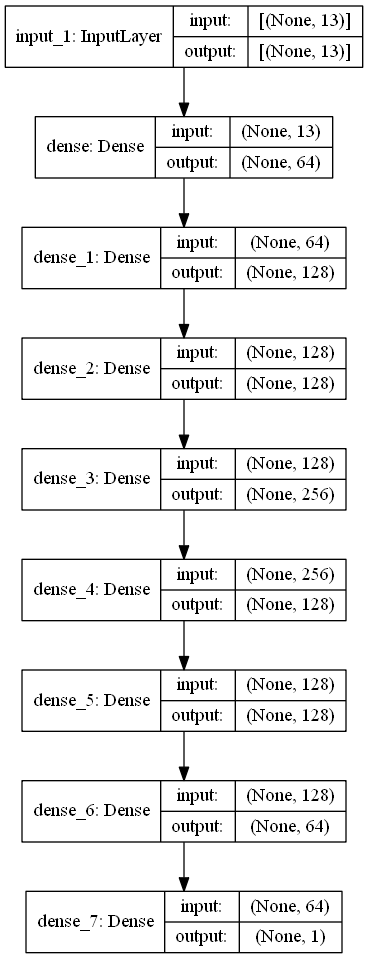
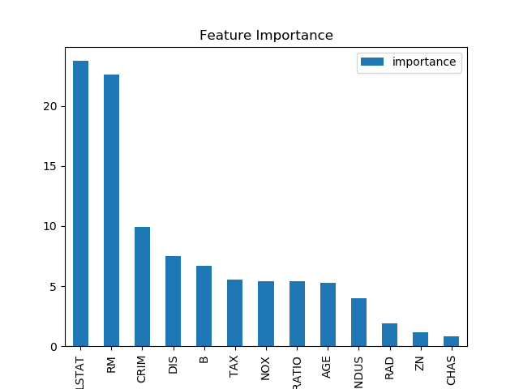

## TensorFlow  + CatBoost Testbed

Simple models to test TensorFlow 2.0 and CatBoost 0.15.2 with a small dataset

The boston housing dataset used in these test cases: [http://lib.stat.cmu.edu/datasets/boston](http://lib.stat.cmu.edu/datasets/boston)


### Features used for prediction
```
CRIM - per capita crime rate by town
ZN - proportion of residential land zoned for lots over 25,000 sq.ft.
INDUS - proportion of non-retail business acres per town.
CHAS - Charles River dummy variable (1 if tract bounds river; 0 otherwise)
NOX - nitric oxides concentration (parts per 10 million)
RM - average number of rooms per dwelling
AGE - proportion of owner-occupied units built prior to 1940
DIS - weighted distances to five Boston employment centres
RAD - index of accessibility to radial highways
TAX - full-value property-tax rate per $10,000
PTRATIO - pupil-teacher ratio by town
B - 1000(Bk - 0.63)^2 where Bk is the proportion of blacks by town 
LSTAT - % lower status of the population
```

### Predicted feature
```
MEDV - Median value of owner-occupied homes in $1000's
```

### Methods

#### Data preparation

Dataset is suffled and split 70% training, 20% validation, 10% testing.

Train samples: 354
Validation samples: 100
Test samples: 52

#### (DNN) Deep neural network

Using `keras` API from TensorFlow  to construct a densely connected multi-layer neural network.
- `elu` activations in `Dense` layers
- `Adam` optimizer
- Trained with `mae` loss function
- Learning rate is decreased on validation loss plateau
- Training is stopped when validation loss no longer seems to be improving even when learning rate is decreased
- Training with mini-batches of 3 samples



#### Test score

Model achieves ~2.7 mean absolute error for test samples. ~2700$ fluctuation between predicted and real value.

### (GB) Gradient boosting

Using `CatBoostRegressor` model from CatBoost.
- Trained with `MAE` loss function
- Training stopped when a plateau on validation error is achieved
- Best model from training is used for predictions

#### Test score

Model achieves ~2.0 mean absolute error for test samples. ~2000$ fluctuation between predicted and real value.

#### Feature importance

The importance of each feature in the prediction solved by CatBoost. The importance of features may be different when predicting with the neural network method.

> Describes how much on average the prediction changes if the feature value changes. The bigger the value of the importance the bigger on average is the change to the prediction value, if this feature is changed. Feature importance values are normalized so that the sum of importances of all features is equal to 100. This is possible because the values of these importances are always non-negative. [more]((https://catboost.ai/docs/concepts/fstr.html))




### Conclusion

CatBoost seems like a better solution for this kind of tabular data as it gives better accuracy and is faster to train even on CPU.

Different DNN achitectures or input normalization didn't seem to much affect the test score.

#### Results

All test cases from one test run:

```
Real prise 21000$, predicted_dnn 20797$, predicted_gb 20057$ Data {0: {'CRIM': 0.47547, 'ZN': 0.0, 'INDUS': 9.9, 'CHAS': 0.0, 'NOX': 0.544, 'RM': 6.113, 'AGE': 58.8, 'DIS': 4.0019, 'RAD': 4.0, 'TAX': 304.0, 'PTRATIO': 18.4, 'B': 396.23, 'LSTAT': 12.73}}
Real prise 23700$, predicted_dnn 27002$, predicted_gb 24753$ Data {0: {'CRIM': 0.12757, 'ZN': 30.0, 'INDUS': 4.93, 'CHAS': 0.0, 'NOX': 0.428, 'RM': 6.393, 'AGE': 7.8, 'DIS': 7.0355, 'RAD': 6.0, 'TAX': 300.0, 'PTRATIO': 16.6, 'B': 374.71, 'LSTAT': 5.19}}
Real prise 18900$, predicted_dnn 18852$, predicted_gb 16027$ Data {0: {'CRIM': 0.0136, 'ZN': 75.0, 'INDUS': 4.0, 'CHAS': 0.0, 'NOX': 0.41, 'RM': 5.888, 'AGE': 47.6, 'DIS': 7.3197, 'RAD': 3.0, 'TAX': 469.0, 'PTRATIO': 21.1, 'B': 396.9, 'LSTAT': 14.8}}
Real prise 16800$, predicted_dnn 20827$, predicted_gb 19248$ Data {0: {'CRIM': 4.22239, 'ZN': 0.0, 'INDUS': 18.1, 'CHAS': 1.0, 'NOX': 0.77, 'RM': 5.803, 'AGE': 89.0, 'DIS': 1.9047, 'RAD': 24.0, 'TAX': 666.0, 'PTRATIO': 20.2, 'B': 353.04, 'LSTAT': 14.64}}
Real prise 19700$, predicted_dnn 20953$, predicted_gb 21437$ Data {0: {'CRIM': 0.08873, 'ZN': 21.0, 'INDUS': 5.64, 'CHAS': 0.0, 'NOX': 0.439, 'RM': 5.963, 'AGE': 45.7, 'DIS': 6.8147, 'RAD': 4.0, 'TAX': 243.0, 'PTRATIO': 16.8, 'B': 395.56, 'LSTAT': 13.45}}
Real prise 17700$, predicted_dnn 20894$, predicted_gb 19237$ Data {0: {'CRIM': 3.69311, 'ZN': 0.0, 'INDUS': 18.1, 'CHAS': 0.0, 'NOX': 0.713, 'RM': 6.376, 'AGE': 88.4, 'DIS': 2.5671, 'RAD': 24.0, 'TAX': 666.0, 'PTRATIO': 20.2, 'B': 391.43, 'LSTAT': 14.65}}
Real prise 22600$, predicted_dnn 23681$, predicted_gb 22823$ Data {0: {'CRIM': 0.08447, 'ZN': 0.0, 'INDUS': 4.05, 'CHAS': 0.0, 'NOX': 0.51, 'RM': 5.859, 'AGE': 68.7, 'DIS': 2.7019, 'RAD': 5.0, 'TAX': 296.0, 'PTRATIO': 16.6, 'B': 393.23, 'LSTAT': 9.64}}
Real prise 11800$, predicted_dnn 10744$, predicted_gb 9069$ Data {0: {'CRIM': 10.6718, 'ZN': 0.0, 'INDUS': 18.1, 'CHAS': 0.0, 'NOX': 0.74, 'RM': 6.459, 'AGE': 94.8, 'DIS': 1.9879, 'RAD': 24.0, 'TAX': 666.0, 'PTRATIO': 20.2, 'B': 43.06, 'LSTAT': 23.98}}
Real prise 34900$, predicted_dnn 33263$, predicted_gb 33493$ Data {0: {'CRIM': 0.0837, 'ZN': 45.0, 'INDUS': 3.44, 'CHAS': 0.0, 'NOX': 0.437, 'RM': 7.185, 'AGE': 38.9, 'DIS': 4.5667, 'RAD': 5.0, 'TAX': 398.0, 'PTRATIO': 15.2, 'B': 396.9, 'LSTAT': 5.39}}
Real prise 20600$, predicted_dnn 21561$, predicted_gb 19173$ Data {0: {'CRIM': 0.04527, 'ZN': 0.0, 'INDUS': 11.93, 'CHAS': 0.0, 'NOX': 0.573, 'RM': 6.12, 'AGE': 76.7, 'DIS': 2.2875, 'RAD': 1.0, 'TAX': 273.0, 'PTRATIO': 21.0, 'B': 396.9, 'LSTAT': 9.08}}
Real prise 20200$, predicted_dnn 22682$, predicted_gb 19364$ Data {0: {'CRIM': 5.82115, 'ZN': 0.0, 'INDUS': 18.1, 'CHAS': 0.0, 'NOX': 0.713, 'RM': 6.513, 'AGE': 89.9, 'DIS': 2.8016, 'RAD': 24.0, 'TAX': 666.0, 'PTRATIO': 20.2, 'B': 393.82, 'LSTAT': 10.29}}
Real prise 32000$, predicted_dnn 30369$, predicted_gb 28961$ Data {0: {'CRIM': 0.07875, 'ZN': 45.0, 'INDUS': 3.44, 'CHAS': 0.0, 'NOX': 0.437, 'RM': 6.782, 'AGE': 41.1, 'DIS': 3.7886, 'RAD': 5.0, 'TAX': 398.0, 'PTRATIO': 15.2, 'B': 393.87, 'LSTAT': 6.68}}
Real prise 22300$, predicted_dnn 19572$, predicted_gb 24155$ Data {0: {'CRIM': 2.44953, 'ZN': 0.0, 'INDUS': 19.58, 'CHAS': 0.0, 'NOX': 0.605, 'RM': 6.402, 'AGE': 95.2, 'DIS': 2.2625, 'RAD': 5.0, 'TAX': 403.0, 'PTRATIO': 14.7, 'B': 330.04, 'LSTAT': 11.32}}
Real prise 23300$, predicted_dnn 23748$, predicted_gb 23459$ Data {0: {'CRIM': 0.15445, 'ZN': 25.0, 'INDUS': 5.13, 'CHAS': 0.0, 'NOX': 0.453, 'RM': 6.145, 'AGE': 29.2, 'DIS': 7.8148, 'RAD': 8.0, 'TAX': 284.0, 'PTRATIO': 19.7, 'B': 390.68, 'LSTAT': 6.86}}
Real prise 14400$, predicted_dnn 16270$, predicted_gb 12390$ Data {0: {'CRIM': 0.25387, 'ZN': 0.0, 'INDUS': 6.91, 'CHAS': 0.0, 'NOX': 0.448, 'RM': 5.399, 'AGE': 95.3, 'DIS': 5.87, 'RAD': 3.0, 'TAX': 233.0, 'PTRATIO': 17.9, 'B': 396.9, 'LSTAT': 30.81}}
Real prise 31200$, predicted_dnn 29806$, predicted_gb 30005$ Data {0: {'CRIM': 0.03049, 'ZN': 55.0, 'INDUS': 3.78, 'CHAS': 0.0, 'NOX': 0.484, 'RM': 6.874, 'AGE': 28.1, 'DIS': 6.4654, 'RAD': 5.0, 'TAX': 370.0, 'PTRATIO': 17.6, 'B': 387.97, 'LSTAT': 4.61}}
Real prise 24000$, predicted_dnn 21798$, predicted_gb 22114$ Data {0: {'CRIM': 0.33045, 'ZN': 0.0, 'INDUS': 6.2, 'CHAS': 0.0, 'NOX': 0.507, 'RM': 6.086, 'AGE': 61.5, 'DIS': 3.6519, 'RAD': 8.0, 'TAX': 307.0, 'PTRATIO': 17.4, 'B': 376.75, 'LSTAT': 10.88}}
Real prise 29600$, predicted_dnn 28323$, predicted_gb 31539$ Data {0: {'CRIM': 0.08221, 'ZN': 22.0, 'INDUS': 5.86, 'CHAS': 0.0, 'NOX': 0.431, 'RM': 6.957, 'AGE': 6.8, 'DIS': 8.9067, 'RAD': 7.0, 'TAX': 330.0, 'PTRATIO': 19.1, 'B': 386.09, 'LSTAT': 3.53}}
Real prise 19600$, predicted_dnn 19302$, predicted_gb 17899$ Data {0: {'CRIM': 0.85204, 'ZN': 0.0, 'INDUS': 8.14, 'CHAS': 0.0, 'NOX': 0.538, 'RM': 5.965, 'AGE': 89.2, 'DIS': 4.0123, 'RAD': 4.0, 'TAX': 307.0, 'PTRATIO': 21.0, 'B': 392.53, 'LSTAT': 13.83}}
Real prise 21600$, predicted_dnn 23438$, predicted_gb 22703$ Data {0: {'CRIM': 0.26938, 'ZN': 0.0, 'INDUS': 9.9, 'CHAS': 0.0, 'NOX': 0.544, 'RM': 6.266, 'AGE': 82.8, 'DIS': 3.2628, 'RAD': 4.0, 'TAX': 304.0, 'PTRATIO': 18.4, 'B': 393.39, 'LSTAT': 7.9}}
Real prise 20000$, predicted_dnn 20408$, predicted_gb 18298$ Data {0: {'CRIM': 6.80117, 'ZN': 0.0, 'INDUS': 18.1, 'CHAS': 0.0, 'NOX': 0.713, 'RM': 6.081, 'AGE': 84.4, 'DIS': 2.7175, 'RAD': 24.0, 'TAX': 666.0, 'PTRATIO': 20.2, 'B': 396.9, 'LSTAT': 14.7}}
Real prise 27000$, predicted_dnn 30343$, predicted_gb 23064$ Data {0: {'CRIM': 1.27346, 'ZN': 0.0, 'INDUS': 19.58, 'CHAS': 1.0, 'NOX': 0.605, 'RM': 6.25, 'AGE': 92.6, 'DIS': 1.7984, 'RAD': 5.0, 'TAX': 403.0, 'PTRATIO': 14.7, 'B': 338.92, 'LSTAT': 5.5}}
Real prise 33200$, predicted_dnn 29346$, predicted_gb 32197$ Data {0: {'CRIM': 0.10469, 'ZN': 40.0, 'INDUS': 6.41, 'CHAS': 1.0, 'NOX': 0.447, 'RM': 7.267, 'AGE': 49.0, 'DIS': 4.7872, 'RAD': 4.0, 'TAX': 254.0, 'PTRATIO': 17.6, 'B': 389.25, 'LSTAT': 6.05}}
Real prise 15400$, predicted_dnn 14018$, predicted_gb 13496$ Data {0: {'CRIM': 9.96654, 'ZN': 0.0, 'INDUS': 18.1, 'CHAS': 0.0, 'NOX': 0.74, 'RM': 6.485, 'AGE': 100.0, 'DIS': 1.9784, 'RAD': 24.0, 'TAX': 666.0, 'PTRATIO': 20.2, 'B': 386.73, 'LSTAT': 18.85}}
Real prise 30500$, predicted_dnn 31300$, predicted_gb 29165$ Data {0: {'CRIM': 0.06911, 'ZN': 45.0, 'INDUS': 3.44, 'CHAS': 0.0, 'NOX': 0.437, 'RM': 6.739, 'AGE': 30.8, 'DIS': 6.4798, 'RAD': 5.0, 'TAX': 398.0, 'PTRATIO': 15.2, 'B': 389.71, 'LSTAT': 4.69}}
Real prise 7200$, predicted_dnn 10918$, predicted_gb 9590$ Data {0: {'CRIM': 16.8118, 'ZN': 0.0, 'INDUS': 18.1, 'CHAS': 0.0, 'NOX': 0.7, 'RM': 5.277, 'AGE': 98.1, 'DIS': 1.4261, 'RAD': 24.0, 'TAX': 666.0, 'PTRATIO': 20.2, 'B': 396.9, 'LSTAT': 30.81}}
Real prise 23900$, predicted_dnn 23084$, predicted_gb 23701$ Data {0: {'CRIM': 0.08265, 'ZN': 0.0, 'INDUS': 13.92, 'CHAS': 0.0, 'NOX': 0.437, 'RM': 6.127, 'AGE': 18.4, 'DIS': 5.5027, 'RAD': 4.0, 'TAX': 289.0, 'PTRATIO': 16.0, 'B': 396.9, 'LSTAT': 8.58}}
Real prise 16300$, predicted_dnn 10606$, predicted_gb 12572$ Data {0: {'CRIM': 28.6558, 'ZN': 0.0, 'INDUS': 18.1, 'CHAS': 0.0, 'NOX': 0.597, 'RM': 5.155, 'AGE': 100.0, 'DIS': 1.5894, 'RAD': 24.0, 'TAX': 666.0, 'PTRATIO': 20.2, 'B': 210.97, 'LSTAT': 20.08}}
Real prise 23900$, predicted_dnn 28127$, predicted_gb 25308$ Data {0: {'CRIM': 0.02543, 'ZN': 55.0, 'INDUS': 3.78, 'CHAS': 0.0, 'NOX': 0.484, 'RM': 6.696, 'AGE': 56.4, 'DIS': 5.7321, 'RAD': 5.0, 'TAX': 370.0, 'PTRATIO': 17.6, 'B': 396.9, 'LSTAT': 7.18}}
Real prise 50000$, predicted_dnn 44568$, predicted_gb 43526$ Data {0: {'CRIM': 0.61154, 'ZN': 20.0, 'INDUS': 3.97, 'CHAS': 0.0, 'NOX': 0.647, 'RM': 8.704, 'AGE': 86.9, 'DIS': 1.801, 'RAD': 5.0, 'TAX': 264.0, 'PTRATIO': 13.0, 'B': 389.7, 'LSTAT': 5.12}}
Real prise 22800$, predicted_dnn 29720$, predicted_gb 29070$ Data {0: {'CRIM': 0.49298, 'ZN': 0.0, 'INDUS': 9.9, 'CHAS': 0.0, 'NOX': 0.544, 'RM': 6.635, 'AGE': 82.5, 'DIS': 3.3175, 'RAD': 4.0, 'TAX': 304.0, 'PTRATIO': 18.4, 'B': 396.9, 'LSTAT': 4.54}}
Real prise 15400$, predicted_dnn 15139$, predicted_gb 16646$ Data {0: {'CRIM': 2.73397, 'ZN': 0.0, 'INDUS': 19.58, 'CHAS': 0.0, 'NOX': 0.871, 'RM': 5.597, 'AGE': 94.9, 'DIS': 1.5257, 'RAD': 5.0, 'TAX': 403.0, 'PTRATIO': 14.7, 'B': 351.85, 'LSTAT': 21.45}}
Real prise 19200$, predicted_dnn 19332$, predicted_gb 17590$ Data {0: {'CRIM': 0.34006, 'ZN': 0.0, 'INDUS': 21.89, 'CHAS': 0.0, 'NOX': 0.624, 'RM': 6.458, 'AGE': 98.9, 'DIS': 2.1185, 'RAD': 4.0, 'TAX': 437.0, 'PTRATIO': 21.2, 'B': 395.04, 'LSTAT': 12.6}}
Real prise 19600$, predicted_dnn 18883$, predicted_gb 17184$ Data {0: {'CRIM': 1.49632, 'ZN': 0.0, 'INDUS': 19.58, 'CHAS': 0.0, 'NOX': 0.871, 'RM': 5.404, 'AGE': 100.0, 'DIS': 1.5916, 'RAD': 5.0, 'TAX': 403.0, 'PTRATIO': 14.7, 'B': 341.6, 'LSTAT': 13.28}}
Real prise 22600$, predicted_dnn 21757$, predicted_gb 20339$ Data {0: {'CRIM': 4.26131, 'ZN': 0.0, 'INDUS': 18.1, 'CHAS': 0.0, 'NOX': 0.77, 'RM': 6.112, 'AGE': 81.3, 'DIS': 2.5091, 'RAD': 24.0, 'TAX': 666.0, 'PTRATIO': 20.2, 'B': 390.74, 'LSTAT': 12.67}}
Real prise 33200$, predicted_dnn 27371$, predicted_gb 33280$ Data {0: {'CRIM': 0.0686, 'ZN': 0.0, 'INDUS': 2.89, 'CHAS': 0.0, 'NOX': 0.445, 'RM': 7.416, 'AGE': 62.5, 'DIS': 3.4952, 'RAD': 2.0, 'TAX': 276.0, 'PTRATIO': 18.0, 'B': 396.9, 'LSTAT': 6.19}}
Real prise 50000$, predicted_dnn 23284$, predicted_gb 23541$ Data {0: {'CRIM': 8.26725, 'ZN': 0.0, 'INDUS': 18.1, 'CHAS': 1.0, 'NOX': 0.668, 'RM': 5.875, 'AGE': 89.6, 'DIS': 1.1296, 'RAD': 24.0, 'TAX': 666.0, 'PTRATIO': 20.2, 'B': 347.88, 'LSTAT': 8.88}}
Real prise 22200$, predicted_dnn 22807$, predicted_gb 23779$ Data {0: {'CRIM': 0.07151, 'ZN': 0.0, 'INDUS': 4.49, 'CHAS': 0.0, 'NOX': 0.449, 'RM': 6.121, 'AGE': 56.8, 'DIS': 3.7476, 'RAD': 3.0, 'TAX': 247.0, 'PTRATIO': 18.5, 'B': 395.15, 'LSTAT': 8.44}}
Real prise 14900$, predicted_dnn 17830$, predicted_gb 14820$ Data {0: {'CRIM': 7.75223, 'ZN': 0.0, 'INDUS': 18.1, 'CHAS': 0.0, 'NOX': 0.713, 'RM': 6.301, 'AGE': 83.7, 'DIS': 2.7831, 'RAD': 24.0, 'TAX': 666.0, 'PTRATIO': 20.2, 'B': 272.21, 'LSTAT': 16.23}}
Real prise 19800$, predicted_dnn 21217$, predicted_gb 22810$ Data {0: {'CRIM': 0.04544, 'ZN': 0.0, 'INDUS': 3.24, 'CHAS': 0.0, 'NOX': 0.46, 'RM': 6.144, 'AGE': 32.2, 'DIS': 5.8736, 'RAD': 4.0, 'TAX': 430.0, 'PTRATIO': 16.9, 'B': 368.57, 'LSTAT': 9.09}}
Real prise 23700$, predicted_dnn 19554$, predicted_gb 16858$ Data {0: {'CRIM': 0.28955, 'ZN': 0.0, 'INDUS': 10.59, 'CHAS': 0.0, 'NOX': 0.489, 'RM': 5.412, 'AGE': 9.8, 'DIS': 3.5875, 'RAD': 4.0, 'TAX': 277.0, 'PTRATIO': 18.6, 'B': 348.93, 'LSTAT': 29.55}}
Real prise 19000$, predicted_dnn 13143$, predicted_gb 15014$ Data {0: {'CRIM': 3.77498, 'ZN': 0.0, 'INDUS': 18.1, 'CHAS': 0.0, 'NOX': 0.655, 'RM': 5.952, 'AGE': 84.7, 'DIS': 2.8715, 'RAD': 24.0, 'TAX': 666.0, 'PTRATIO': 20.2, 'B': 22.01, 'LSTAT': 17.15}}
Real prise 20300$, predicted_dnn 21335$, predicted_gb 22938$ Data {0: {'CRIM': 0.07165, 'ZN': 0.0, 'INDUS': 25.65, 'CHAS': 0.0, 'NOX': 0.581, 'RM': 6.004, 'AGE': 84.1, 'DIS': 2.1974, 'RAD': 2.0, 'TAX': 188.0, 'PTRATIO': 19.1, 'B': 377.67, 'LSTAT': 14.27}}
Real prise 11900$, predicted_dnn 21940$, predicted_gb 18213$ Data {0: {'CRIM': 0.04741, 'ZN': 0.0, 'INDUS': 11.93, 'CHAS': 0.0, 'NOX': 0.573, 'RM': 6.03, 'AGE': 80.8, 'DIS': 2.505, 'RAD': 1.0, 'TAX': 273.0, 'PTRATIO': 21.0, 'B': 396.9, 'LSTAT': 7.88}}
Real prise 13600$, predicted_dnn 13529$, predicted_gb 15104$ Data {0: {'CRIM': 1.25179, 'ZN': 0.0, 'INDUS': 8.14, 'CHAS': 0.0, 'NOX': 0.538, 'RM': 5.57, 'AGE': 98.1, 'DIS': 3.7979, 'RAD': 4.0, 'TAX': 307.0, 'PTRATIO': 21.0, 'B': 376.57, 'LSTAT': 21.02}}
Real prise 29800$, predicted_dnn 32202$, predicted_gb 30603$ Data {0: {'CRIM': 0.12579, 'ZN': 45.0, 'INDUS': 3.44, 'CHAS': 0.0, 'NOX': 0.437, 'RM': 6.556, 'AGE': 29.1, 'DIS': 4.5667, 'RAD': 5.0, 'TAX': 398.0, 'PTRATIO': 15.2, 'B': 382.84, 'LSTAT': 4.56}}
Real prise 21700$, predicted_dnn 22055$, predicted_gb 21496$ Data {0: {'CRIM': 0.15876, 'ZN': 0.0, 'INDUS': 10.81, 'CHAS': 0.0, 'NOX': 0.413, 'RM': 5.961, 'AGE': 17.5, 'DIS': 5.2873, 'RAD': 4.0, 'TAX': 305.0, 'PTRATIO': 19.2, 'B': 376.94, 'LSTAT': 9.88}}
Real prise 19500$, predicted_dnn 17365$, predicted_gb 15914$ Data {0: {'CRIM': 0.1712, 'ZN': 0.0, 'INDUS': 8.56, 'CHAS': 0.0, 'NOX': 0.52, 'RM': 5.836, 'AGE': 91.9, 'DIS': 2.211, 'RAD': 5.0, 'TAX': 384.0, 'PTRATIO': 20.9, 'B': 395.67, 'LSTAT': 18.66}}
Real prise 21100$, predicted_dnn 21190$, predicted_gb 20696$ Data {0: {'CRIM': 0.29916, 'ZN': 20.0, 'INDUS': 6.96, 'CHAS': 0.0, 'NOX': 0.464, 'RM': 5.856, 'AGE': 42.1, 'DIS': 4.429, 'RAD': 3.0, 'TAX': 223.0, 'PTRATIO': 18.6, 'B': 388.65, 'LSTAT': 13.0}}
Real prise 24500$, predicted_dnn 28697$, predicted_gb 26489$ Data {0: {'CRIM': 0.01501, 'ZN': 80.0, 'INDUS': 2.01, 'CHAS': 0.0, 'NOX': 0.435, 'RM': 6.635, 'AGE': 29.7, 'DIS': 8.344, 'RAD': 4.0, 'TAX': 280.0, 'PTRATIO': 17.0, 'B': 390.94, 'LSTAT': 5.99}}
Real prise 13400$, predicted_dnn 11828$, predicted_gb 11595$ Data {0: {'CRIM': 11.1604, 'ZN': 0.0, 'INDUS': 18.1, 'CHAS': 0.0, 'NOX': 0.74, 'RM': 6.629, 'AGE': 94.6, 'DIS': 2.1247, 'RAD': 24.0, 'TAX': 666.0, 'PTRATIO': 20.2, 'B': 109.85, 'LSTAT': 23.27}}
Real prise 18600$, predicted_dnn 16763$, predicted_gb 18490$ Data {0: {'CRIM': 0.22876, 'ZN': 0.0, 'INDUS': 8.56, 'CHAS': 0.0, 'NOX': 0.52, 'RM': 6.405, 'AGE': 85.4, 'DIS': 2.7147, 'RAD': 5.0, 'TAX': 384.0, 'PTRATIO': 20.9, 'B': 70.8, 'LSTAT': 10.63}}
```